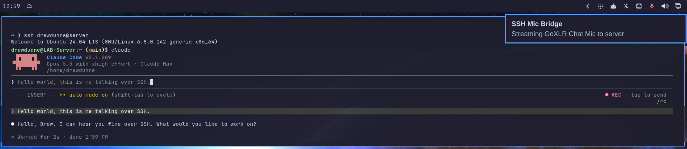

# SSH Mic Bridge

### Talk to CLI Agents on your server. Over SSH. Finally.

> **A local microphone:** voice dictation does not work in cloud sessions or
> SSH sessions.
>
> — [Claude Code docs, Voice dictation](https://code.claude.com/docs/en/voice-dictation#requirements)

`/voice` is great, until your agent lives on a server. The agent has no access
to your microphone, so unless you are opening your phone to dictate
instructions, you've been typing.

**With SSH Mic Bridge, "voice mode doesn't work over SSH" is a thing of the
past.** Press SUPER + ALT + V, run `/voice` in your SSH session, and talk.
Your words land in Claude's prompt on the server, as if your mic were plugged
in there.



*Claude Code running on an Ubuntu server over SSH, hearing a mic plugged into
an Omarchy desktop. Spoken, not typed.*

```
your mic ──parec──▶ ssh you@server ──pacat──▶ vmic ──▶ vmic_mic (the server's default input) ──▶ Claude /voice
```

It's an [Omarchy](https://omarchy.org/) plugin, so it feels like part of your
desktop. It isn't only for Claude, either: anything on the server that records
the default mic hears you.

## Why it's nice

- **One key and you're live.** SUPER + ALT + V, or a click on the mic in your
  bar. The icon lights up while you're streaming, so you always know.
- **Any mic you own.** A USB mic, a headset, or an audio interface. Pick it from
  a menu, or name it: `ssh-mic-bridge mic "Yeti"`.
- **Just SSH.** It rides the SSH access you already have: no ports to open, no
  audio server exposed on the network, nothing to configure on your router.
- **Transcribes like a real mic.** A virtual mic is digital silence between
  words, and speech-to-text gives up on silence. The server half plays a faint,
  ever-changing noise floor underneath, like the room noise a real mic always
  picks up, so Claude stays listening.
- **Shrugs off hiccups.** It runs as a user service that survives shell and
  Hyprland restarts, and reconnects by itself after a network blip.
- **Three commands to set up**, and `setup server` does the server side for
  you, checking and asking first.

## Quick start

```bash
omarchy plugin add https://github.com/drewdunne/omarchy-ssh-mic-bridge.git --yes
~/.config/omarchy/plugins/gg.arkship.ssh-mic-bridge/setup install
~/.config/omarchy/plugins/gg.arkship.ssh-mic-bridge/setup server you@server
```

Then: SUPER + ALT + V, `ssh you@server`, `claude`, `/voice tap`, and start
talking.

## What you get

| Where | What |
|---|---|
| SUPER + ALT + V | Start or stop streaming |
| Bar mic, left click | Start or stop streaming |
| Bar mic, middle click | Choose a microphone |
| Bar mic, right click | Trigger > SSH Mic Bridge |
| Trigger > SSH Mic Bridge | Start, Stop, Choose Microphone, Hear What the Server Hears, Set Up Server |

The bar mic is dim and crossed out when off, and lit while streaming. Its
tooltip names the mic and the server.

## Requirements

- **This machine:** Omarchy 4 (Hyprland 0.56+ with Lua config, PipeWire), and
  SSH access to the server.
- **Server:** Linux with a systemd user session, `python3`, and PipeWire with
  `pipewire-pulse` and `pipewire-alsa`. Plain PulseAudio with its ALSA plugin
  works too. No GUI, no sound card and no open ports are needed. The ALSA part
  matters because Claude Code records through ALSA, and `pipewire-alsa` points
  ALSA at the virtual mic. `setup server` checks for all of this and tells you
  what to install.

## What setup does

`setup install` asks before changing anything. It backs up and adds a small
marked block to `~/.config/hypr/hyprland.lua` (the keybinding) and to
`~/.config/omarchy/extensions/omarchy-menu.jsonc` (the menu). It also links
`ssh-mic-bridge` into `~/.local/bin` and adds the bar widget next to the
volume control.

`setup server` checks the server and asks before installing its half:
`vmic-keepalive` and a user service for it. It then makes the virtual mic the
server's default input. If the server lacks something, it tells you what to
install and stops. It never runs sudo.

## Choose a microphone

Middle-click the bar mic, or pick Trigger > SSH Mic Bridge > Choose
Microphone. Every input on this machine is listed by name, and picking one
starts streaming from it. From a terminal, name it:

```bash
ssh-mic-bridge mics               # list them
ssh-mic-bridge mic "Yeti"         # any part of a mic's name, ignoring case
ssh-mic-bridge mic default        # follow the system default input
ssh-mic-bridge which              # the device that would be streamed
```

A name has to match exactly one mic. "Desk" won't do when there are "Desk Mic
1" and "Desk Mic 2"; the error lists them. The choice is saved by its name, so
it still works when a sound card switches profiles and its devices get new IDs.

Pick an input that carries only your voice. Some audio interfaces also offer
mixes (like a GoXLR's "Stream Mix") that add music or game audio. Streaming
every channel of a multichannel interface can comb-filter your voice.

## Settings

`~/.config/ssh-mic-bridge/config`, written by the commands above and fine to
edit:

```bash
SSH_MIC_BRIDGE_HOST=you@server   # where the virtual mic lives
SSH_MIC_BRIDGE_MIC=Yeti          # default, a source name, or part of a mic's name
```

To use a different key, edit `~/.config/hypr/bindings.lua`:

```lua
hl.unbind("SUPER + ALT + V")
o.bind("SUPER + F12", "Mic to server", "ssh-mic-bridge toggle")
```

## How it works

**Locally:** `ssh-mic-bridge start` runs the stream as the transient user unit
`ssh-mic-bridge.service`, so it survives shell and Hyprland restarts. It
captures your mic with `parec` (s16le, 48 kHz, mono) and pipes it into
`ssh you@server pacat --playback --device=vmic`. A dropped connection is
retried every 3 s, at most 5 times a minute. The capture stream has its own
client name, so a mute that WirePlumber stored for another app never applies
to it, and the bridge unmutes it once it starts.

**On the server:** `vmic-keepalive` creates a null sink `vmic`, remaps its
monitor as the source `vmic_mic`, and makes that the default input. It also
plays a faint, continuously fresh noise floor into it, about -52 dBFS.
Without that, the virtual mic is digital silence between words, and
speech-to-text services (Claude Code uses Deepgram) reject a silent source as
"No speech detected". A real mic always carries some room noise. The floor is
generated fresh every 50 ms, because repeating one block of noise turns it
into an audible hum.

**SSH:** the stream runs in the background with `BatchMode`, so SSH must work
without a prompt. If your key has a passphrase and the agent is empty (after a
reboot, say), starting opens a small terminal where ssh asks for it once.
`AddKeysToAgent` then keeps the key for the stream.

## Check and troubleshoot

```bash
~/.config/omarchy/plugins/gg.arkship.ssh-mic-bridge/setup status   # this machine and the server, read-only
ssh-mic-bridge test   # record what reaches the server, show its level, play it back
ssh-mic-bridge log    # this boot's log
```

| Symptom | Fix |
|---|---|
| "Failed to start", Permission denied (publickey) | Run `ssh you@server` once in a terminal, or start again and type the passphrase in the terminal that opens |
| "No virtual mic on the server" | `setup server` |
| Claude says "Voice mode requires a microphone" or "No audio detected from microphone" | Claude records through ALSA: install `pipewire-alsa` on the server (`setup status` shows "ALSA default") |
| Transcript empty, "No speech detected" | `setup status`: vmic.monitor must be RUNNING and the default input vmic_mic |
| The server hears only a flat -52 dBFS in `test` | Only the noise floor arrives: is your mic muted, or the wrong one chosen? (`ssh-mic-bridge which`) |
| It keeps reconnecting, then stops | The server or the network is down: `ssh-mic-bridge log` |

Something else on the server that changes its default input breaks the
bridge. `vmic-keepalive` sets it on every start, so
`systemctl --user restart vmic-keepalive` there puts it back.

## Uninstall

```bash
~/.config/omarchy/plugins/gg.arkship.ssh-mic-bridge/setup server --remove   # the server half
~/.config/omarchy/plugins/gg.arkship.ssh-mic-bridge/setup uninstall
omarchy plugin remove gg.arkship.ssh-mic-bridge
```

`~/.config/ssh-mic-bridge/config` stays until you delete it.

## Development

```bash
bash test/setup.sh             # setup and mic matching against a throwaway HOME
omarchy plugin validate .
```

Saved changes to `SshMicBridge.qml` reload the bar automatically. After
editing `hypr/ssh-mic-bridge.lua`, run `hyprctl reload`.

## Related projects

- [voxtunnel](https://github.com/remmmi/voxtunnel): a tray app that streams a
  mic over SSH into an ALSA loopback device on the server.
- [claude-voice-tunnel](https://github.com/omcnoe/claude-voice-tunnel):
  Claude `/voice` over an SSH-forwarded TCP port into a PipeWire null sink.
- [echocast](https://github.com/hexploder/echocast): an Omarchy widget for the
  other direction, sending your audio to another machine's speakers over SSH.

## License

[MIT](LICENSE)
